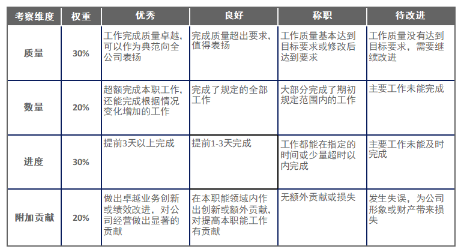
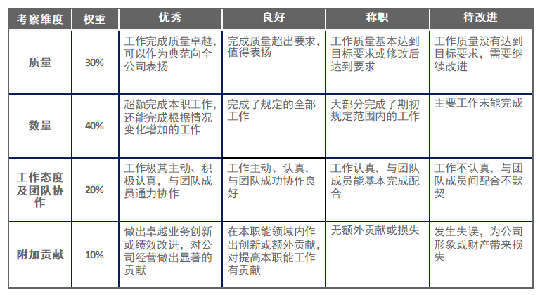
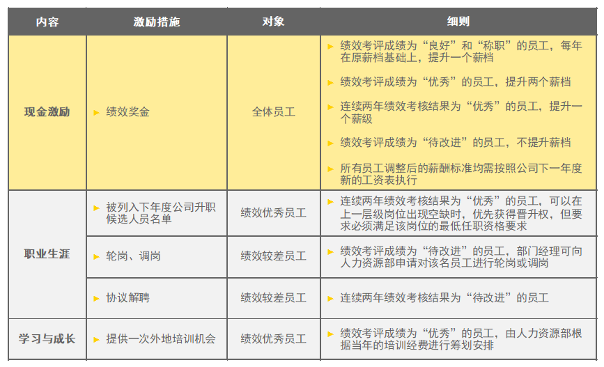
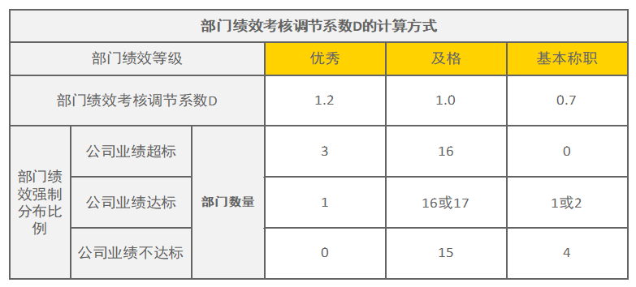
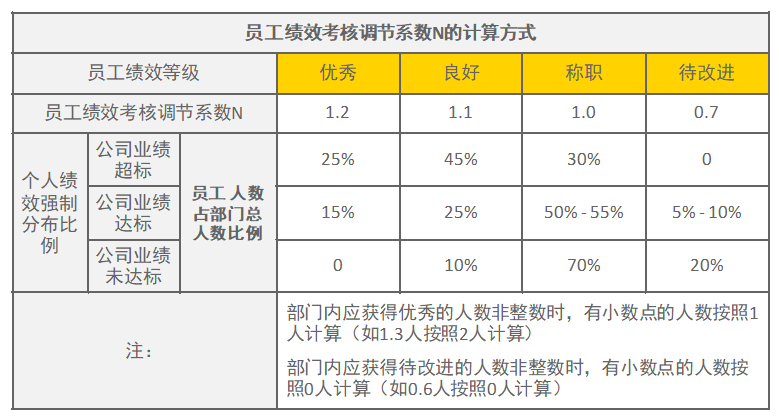

### 【小蜜蜂科技有限公司员工绩效管理办法】第一章 总则 - 第一条
为加强小蜜蜂科技有限公司（以下简称“公司”）绩效管理工作，建立科学化、体系化的员工绩效评价制度，实现以绩效付薪的薪酬管理理念，根据上级单位劳动管理基本制度，结合小蜜蜂科技有限公司的实际情况，并遵照国家有关法律法规，制定本办法。

### 【小蜜蜂科技有限公司员工绩效管理办法】第一章 总则 - 第二条
公司将通过有效的员工绩效管理办法，实现：
- （一） 员工更多地参与自我管理：通过了解组织绩效目标和上级对自己的绩效要求，了解个人工作目标与组织目标之间的关系；通过绩效计划设定和绩效评估反馈了解自身发展需要，提升自身能力；通过绩效管理与员工薪酬及职业发展紧密结合，对员工进行激励：
- （二） 明确管理者的绩效角色：了解员工在工作中出现的问题和困难，并帮助员工提高绩效，为管理者管理员工提供方法和工具；通过一套系统化的绩效管理方法，关注人和人之间、团队和团队之间如何通过协作、互助来完成组织的目标，明确管理者的工作主要就是进行绩效管理：
- （三） 推动绩效导向企业文化的建立：建立“绩效和贡献是利益分配的基本标准”的观念和机制，强调业绩导向，重视执行成效，促进企业文化建设。

### 【小蜜蜂科技有限公司员工绩效管理办法】第一章 总则 - 第三条
员工绩效管理遵循以下原则：
- （一） 战略性原则：通过绩效管理体系分解公司战略目标，使各层级的每个岗位都能承担起公司战略实现的责任：
- （二） 平衡性原则：兼顾定性目标与定量目标的平衡、财务和非财务指标的平衡、外部（客户）与内部（流程和员工）的平衡、结果和过程的平衡：
- （三） 透明性原则：建立科学、公平、公正、透明的绩效管理循环，从制定绩效计划到最终绩效结果的应用，建立起全过程的绩效辅导与沟通流程：
- （四） 激励性原则：员工能够分享由于自身绩效表现为公司创造的价值收益，使绩效管理起到激励作用，促进员工与公司的共同成长：
- （五） 可操作性原则：在不牺牲其他原则的前提下，明晰责任分工，统一管理框架，做到简单、易于操作，降低管理成本。

### 【小蜜蜂科技有限公司员工绩效管理办法】第一章 总则 - 第四条
本办法适用于公司各部门的全体员工，但不包括公司职级L1和L2级的员工，也不包括劳务外委人员。

### 【小蜜蜂科技有限公司员工绩效管理办法】第二章 组织与职责 - 第五条
员工绩效管理的组织体系包括公司的绩效管理体系决策者、员工绩效管理的归口管理部门和员工绩效管理的参与配合部门。

### 【小蜜蜂科技有限公司员工绩效管理办法】第二章 组织与职责 - 第六条
绩效管理体系决策者为公司党政联席会。
绩效管理体系决策者对公司整体绩效管理工作进行指导和决策。其中在员工绩效层面负责审定员工绩效管理体系、审批奖金发放标准和细则、决策与员工绩效管理相关的重大事项。

### 【小蜜蜂科技有限公司员工绩效管理办法】第二章 组织与职责 - 第七条
人力资源部是公司员工绩效管理的归口部门，主要职责包括：
- （一） 制定并完善公司员工绩效管理办法及实施细则；
- （二） 具体策划与推动公司员工绩效管理；
- （三） 对非人力资源部门的管理人员进行有针对性的绩效管理培训与辅导；
- （四） 对各部门员工绩效管理工作进行日常的指导、服务、监督与检查。

### 【小蜜蜂科技有限公司员工绩效管理办法】第二章 组织与职责 - 第八条
公司所有部门作为员工绩效管理的参与部门，主要职责包括：
- （一） 根据人力资源部提供的管理办法与细则，开展具体的员工绩效管理工作；
- （二） 提供员工年终绩效考核评价成绩；
- （三） 部门经理以下员工的绩效考核者为其部门经理和副经理；公司副总以下的中层管理人员（包括董秘、副总工程师、总助、部门正副经理）的绩效考核者为董事长、总经理及公司副总经理；各级绩效考核者（包括部门经理、总经理）应充分理解员工绩效管理的意义和作用，熟练掌握绩效管理的技巧和方法，严格按照绩效管理的原则，对员工依照职位层级和责任范围，实行自上而下的管理，是其直接下属员工绩效管理的直接责任人，是其绩效考核指标与指标值的制定人、评估人；
- （四） 员工应认真参与年度绩效管理工作。在制定绩效计划时，积极与绩效考核人进行沟通，讨论并最终商定年度绩效考核指标和指标值；在年中进行绩效辅导时，主动提出自己在工作中遇到的难点和困难，积极寻求绩效考核者的辅导与帮助；在年终进行绩效评估时，实事求是地描述自己在过去一年的绩效表现，并配合绩效考核者完成年终绩效评估。

### 【小蜜蜂科技有限公司员工绩效管理办法】第三章 员工绩效管理循环构成 - 第九条
小蜜蜂科技有限公司员工绩效管理体系作为一个闭环，由以下四部分构成：
- （一） 绩效计划与目标设定：制定绩效目标，反复沟通并建立共识，是年度绩效管理的开始；
- （二） 绩效中期辅导与调整：对每个季度的绩效表现进行观察与记录，对绩效目标进行中期评估和调整，是年度绩效管理中的期中指导与反馈；
- （三） 绩效考核与评估：对过去一年的绩效表现进行考核与评价，是年度绩效管理的总结；
- （四） 绩效激励：对绩效考核结果的奖惩兑现。

### 【小蜜蜂科技有限公司员工绩效管理办法】第四章 员工绩效管理的具体开展 - 第十条
每年的3月份是公司新一个绩效考核年的起始。绩效考核者与员工应在3月15日前完成新一年绩效考核指标与指标值的确定，并提交人力资源部备案。在设立员工年度绩效目标时，各级绩效考核者要根据公司战略规划、部门年度工作计划、职位说明书等方面内容，确定员工的绩效考核指标及指标值，并与员工本人协商确定。绩效指标和指标值的设定要具体、切合实际、易于理解和操作。

### 【小蜜蜂科技有限公司员工绩效管理办法】第四章 员工绩效管理的具体开展 - 第十一条
每年的二季度末和三季度末应开展员工半年绩效辅导工作。绩效辅导作为员工绩效管理体系的核心，贯穿于员工绩效管理的全过程。管理者要与员工一起对绩效实现过程中的得失进行诊断。对取得的成绩予以肯定和表扬，对尚存差距进行分析，找出原因，设计消除差距的工作计划，并评估问题是否解决。管理者应始终与员工保持一种合作的关系，围绕员工绩效的改善和目标的完成进行有针对性的辅导，并对辅导效果进行跟踪、记录和反馈。

### 【小蜜蜂科技有限公司员工绩效管理办法】第四章 员工绩效管理的具体开展 - 第十二条
每年的12月，各部门组织开展年终员工绩效考核工作，并在次年的1月底前将当年的绩效考核结果提交人力资源部。绩效考核时，要求员工本人提交自我绩效评估报告，其直接上级根据员工绩效表现进行考核、评价。对当年职位发生调整的员工，在新职位工作不满半年的，由其原部门负责人对其绩效表现进行考核，并参考新部门负责人的绩效考核评价；在新职位工作满半年的，由新的部门负责人对其绩效表现进行考核，并参考原部门负责人的绩效考核评价。

### 【小蜜蜂科技有限公司员工绩效管理办法】第五章 员工绩效评价结果的确定与应用 - 第十三条
职能部门和生产部门应分别参考下表，对被考核者进行评价。员工绩效评价结果共分为四类，分别是“优秀”、“良好”、“称职”和“待改进”。具体的获评人数由公司按照强制分布的原则进行确定。
职能部门员工绩效考核标准

##### 职能部门员工绩效考核标准（结构化数据）
| 考察维度 | 权重 | 优秀 | 良好 | 称职 | 待改进 |
| :--- | :---: | :--- | :--- | :--- | :--- |
| **质量** | 30% | 工作完成质量卓越，可以作为典范向全公司表扬 | 完成质量超出要求，值得表扬 | 工作质量基本达到目标要求或修改后达到要求 | 工作质量没有达到目标要求，需要继续改进 |
| **数量** | 20% | 超额完成本职工作，还能完成根据情况变化增加的工作 | 完成了规定的全部工作 | 大部分完成了期初规定范围内的工作 | 主要工作未能完成 |
| **进度** | 30% | 提前3天以上完成 | 提前1-3天完成 | 工作都能在指定的时间或少量超时以内完成 | 主要工作未能及时完成 |
| **附加贡献** | 20% | 做出卓越业务创新或绩效改进，对公司经营做出显著的贡献 | 在本职能领域内作出创新或额外贡献，对提高本职能工作有贡献 | 无额外贡献或损失 | 发生失误，为公司形象或财产带来损失 |

生产部门员工绩效考核标准

##### 生产部门员工绩效考核标准（结构化数据）

| 考察维度 | 权重 | 优秀 | 良好 | 称职 | 待改进 |
| :--- | :---: | :--- | :--- | :--- | :--- |
| **质量** | 30% | 工作完成质量卓越，可以作为典范向全公司表扬 | 完成质量超出要求，值得表扬 | 工作质量基本达到目标要求或修改后达到要求 | 工作质量没有达到目标要求，需要继续改进 |
| **数量** | 40% | 超额完成本职工作，还能完成根据情况变化增加的工作 | 完成了规定的全部工作 | 大部分完成了期初规定范围内的工作 | 主要工作未能完成 |
| **工作态度及团队协作** | 20% | 工作极其主动、积极认真，与团队成员通力协作 | 工作主动、认真，与团队成功协作良好 | 工作认真，与团队成员能基本完成配合 | 工作不认真，与团队成员间配合不默契 |
| **附加贡献** | 10% | 做出卓越业务创新或绩效改进，对公司经营做出显著的贡献 | 在本职能领域内作出创新或额外贡献，对提高本职能工作有贡献 | 无额外贡献或损失 | 发生失误，为公司形象或财产带来损失 |

### 【小蜜蜂科技有限公司员工绩效管理办法】第五章 员工绩效评价结果的确定与应用 - 第十四条
各级管理人员在完成当年的绩效考核后，应就考核结果同员工进行面谈，反馈考核结果。各级管理人员在充分肯定员工成绩的同时，应帮助其寻找差距，共同制定改善措施。如员工与其上级主管就最终考核结果存在较大的分歧，可根据公司相关流程进行申诉。

### 【小蜜蜂科技有限公司员工绩效管理办法】第五章 员工绩效评价结果的确定与应用 - 第十五条
个人绩效考核结果与绩效奖金、职业生涯、学习培训等进行挂钩。

##### 个人绩效考核结果的应用（结构化数据）
| 内容 | 激励措施 | 对象 | 细则 |
| :--- | :--- | :--- | :--- |
| **现金激励** | 绩效奖金 | 全体员工 | <li> 绩效考评成绩为“良好”和“称职”的员工，每年在原薪档基础上，提升一个薪档； </li><li> 绩效考评成绩为“优秀”的员工，提升两个薪档； </li><li> 连续两年绩效考核结果为“优秀”的员工，提升一个薪级； </li><li> 绩效考评成绩为“待改进”的员工，不提升薪档； </li><li> 所有员工调整后的薪酬标准均需按照公司下一年度新的工资表执行。 </li> |
| **职业生涯** | 被列入下年度公司升职候选人员名单 | 绩效优秀员工 | 连续两年绩效考核结果为“优秀”的员工，可以在上一层级岗位出现空缺时，优先获得晋升权，但要求必须满足该岗位的最低任职资格要求。 |
| **职业生涯** | 轮岗、调岗 | 绩效较差员工 | 绩效考评成绩为“待改进”的员工，部门经理可向人力资源部申请对该员工进行轮岗或调岗。 |
| **职业生涯** | 协议解聘 | 绩效较差员工 | 连续两年绩效考核结果为“待改进”的员工。 |
| **学习与成长** | 提供一次外地培训机会 | 绩效优秀员工 | 绩效考评成绩为“优秀”的员工，由人力资源部根据当年的培训经费进行筹划安排。 |

### 【小蜜蜂科技有限公司员工绩效管理办法】第六章 绩效奖金分配流程 - 第十六条
员工绩效奖金分配流程如下：
- （一） 年底，公司参考上级单位当年的考核项，对公司的业绩进行自评。参考自评结果，设定当年的 <部门绩效考核强制分布比例>和 <员工绩效考核强制分布比例>。公司根据年初设定的部门平衡计分卡考核表，确定部门绩效评分，然后比对<部门绩效考核强制分布比例>，确定部门的绩效等级评定。同时，根据所估算的公司当年剩余工资总额，确定当年可发放的<公司可发年度绩效奖金总额T可发>；
- （二） 员工直线经理根据当年公司所确定的<部门绩效考核强制分布比例>和<员工绩效考核强制分布比例>，进行员工的绩效评分。人力资源部根据员工与部门的绩效评分，参考<绩效考核结果与奖金调节系数对照表>，计算出每位员工当年的<个人应发年度绩效奖金P应发>，即个人应发年度绩效奖金P应发 =个人年度目标绩效奖金 P目标× 部门绩效考核调节系数 D × 员工绩效考核调节系数 N；

##### 部门绩效考核调节系数D的计算方式（结构化数据）
| 部门绩效等级 | 优秀 | 及格 | 基本称职 |
| :--- | :---: | :---: | :---: |
| **部门绩效考核调节系数 D** | 1.2 | 1.0 | 0.7 |
| **部门数量（公司业绩超标时）** | 3 | 16 | 0 |
| **部门数量（公司业绩达标时）** | 1 | 16或17 | 1或2 |
| **部门数量（公司业绩不达标时）** | 0 | 15 | 4 |

##### 员工绩效考核调节系数N的计算方式（结构化数据）

| 员工绩效等级 | 优秀 | 良好 | 称职 | 待改进 |
| :--- | :---: | :---: | :---: | :---: |
| **员工绩效考核调节系数 N** | 1.2 | 1.1 | 1.0 | 0.7 |
| **个人绩效强制分布比例（公司业绩超标时）** | 25% | 45% | 30% | 0 |
| **个人绩效强制分布比例（公司业绩达标时）** | 15% | 25% | 50% - 55% | 5% - 10% |
| **个人绩效强制分布比例（公司业绩未达标时）** | 0 | 10% | 70% | 20% |

*注：*
* *部门内应获得优秀的人数非整数时，有小数点的人数按照1人计算（如1.3人按照2人计算）*
* *部门内应获得待改进的人数非整数时，有小数点的人数按照0人计算（如0.6人按照0人计算）*
- （三） 人力资源部汇总所有人的<个人应发年度绩效奖金P应发>，得出<公司应发年度绩效奖金总额T应发>，与<公司可发年度绩效奖金总额T可发>相除，得到<公司年度绩效奖金调节系数 M >；
- （四） 人力资源部将<公司年度绩效奖金调节系数 M>回带 <个人应发年度绩效奖金P>应发，得到年终奖发放数额。

### 【小蜜蜂科技有限公司员工绩效管理办法】第六章 绩效奖金分配流程 - 第十七条
新进员工的绩效奖金计算：
- （一） 在年终计算绩效奖金时，入职未满半年的非新进学生员工，按月折算后发放其目标绩效奖金的50%，同时不参加当年的部门绩效考核，不计入部门绩效强制分布人数；入职满半年的非新进学生员工，按月折算后确定其目标绩效奖金，同时参加当年的部门绩效考核并记入部门绩效强制分布人数：
- （二） 在年终计算绩效奖金时，入职未满半年的新进学生员工，按月折算后发放其目标绩效奖金的30%，同时不参加当年的部门绩效考核，不计入部门绩效强制分布人数；入职满半年的新进学生员工，按月折算后确定其目标绩效奖金，同时参加当年的部门绩效考核并记入部门绩效强制分布人数。

### 【小蜜蜂科技有限公司员工绩效管理办法】第六章 绩效奖金分配流程 - 第十八条
岗位变动员工的绩效奖金计算：
岗位调动的员工，不论变动后的岗位升高或降低，当年目标绩效奖金均执行调动前的标准，直至下一年的绩效考核循环开始。

### 【小蜜蜂科技有限公司员工绩效管理办法】第七章 外派人员的员工绩效考核 - 第十九条
外派人员的绩效考核办法参考本办法的第四章、第五章、第六章执行；

### 【小蜜蜂科技有限公司员工绩效管理办法】第七章 外派人员的员工绩效考核 - 第二十条
外派人员的绩效考核经理为其外派单位的总经理；

### 【小蜜蜂科技有限公司员工绩效管理办法】第七章 外派人员的员工绩效考核 - 第二十一条
外派人员的部门绩效考核调节系数统一按照1.0计算；外派人员的个人绩效强制分布比例与公司的保持一致，并以所在外派单位的所有外派人员为基数。

### 【小蜜蜂科技有限公司员工绩效管理办法】第八章 附则 - 第二十二条
本办法由人力资源部负责解释，并经由公司党政联席会审批后，颁布实施。

### 【小蜜蜂科技有限公司员工绩效管理办法】第八章 附则 - 第二十三条
本办法自发布之日起施行。

### 【小蜜蜂科技有限公司员工绩效管理办法】第九章 附件 - 附件一：职能部门员工个人绩效考核表
[点击下载 Word 模板](attachments/附件一：职能部门员工个人绩效考核表.docx)

**附件说明：**
本附件为小蜜蜂科技有限公司**职能部门员工**个人绩效考核表的空白 Word 模板。
该表完整涵盖了职能部门员工绩效评价的核心要素，设计结构如下：
1. **基础信息**：包含任职部门、任职者职务及姓名、评估者职务及姓名等。
2. **考核维度与权重**：
   - **质量 (权重 30%)**：评估工作完成质量是否达到或超出目标要求。
   - **数量 (权重 20%)**：评估是否完成规定的全部或大部分工作，或超额完成。
   - **进度 (权重 30%)**：评估是否在指定时间或提前完成工作。
   - **附加贡献 (权重 20%)**：评估是否有业务创新或是否存在失误造成损失。
3. **记录与记录确认**：
   - 期初目标设定确认（本人签名、评估者签名及日期）
   - 第一次与第二次期中绩效辅导谈话记录（自我评语及上级评语）
   - 期末绩效评价谈话记录（自我评语及上级评语）
   - 最终评分等级（优秀、良好、称职、待改进）与考核得分填写区。

### 【小蜜蜂科技有限公司员工绩效管理办法】第九章 附件 - 附件二：生产作业部门员工个人绩效考核表
[点击下载 Word 模板](attachments/附件二：生产作业部门员工个人绩效考核表.docx)

**附件说明：**
本附件为小蜜蜂科技有限公司**生产作业部门员工**个人绩效考核表的空白 Word 模板。
该表完整涵盖了生产序列员工绩效评价的核心要素，设计结构如下：
1. **基础信息**：包含任职部门、任职者职务及姓名、评估者职务及姓名等。
2. **考核维度与权重**：
   - **质量 (权重 30%)**：评估工作质量是否达到目标或超出要求。
   - **数量 (权重 40%)**：评估是否超额完成、或完成全部工作。
   - **工作态度及团队协作 (权重 20%)**：评估工作主动性、协作态度及默契配合程度。
   - **附加贡献 (权重 10%)**：评估是否有卓越创新或额外贡献，或存在工作失误。
3. **记录与记录确认**：
   - 期初目标设定确认（本人签名、评估者签名及日期）
   - 第一次与第二次期中绩效辅导谈话记录（自我评语及上级评语）
   - 期末绩效评价谈话记录（自我评语及上级评语）
   - 最终评分等级（优秀、良好、称职、待改进）与考核得分填写区。
