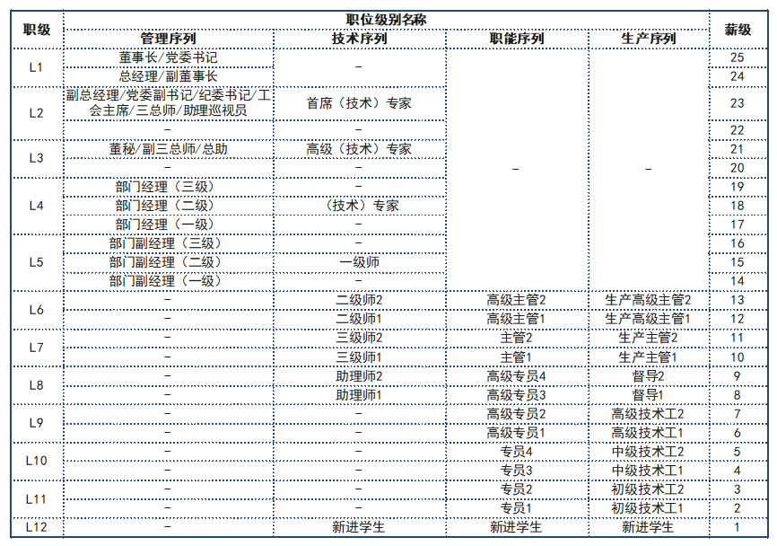
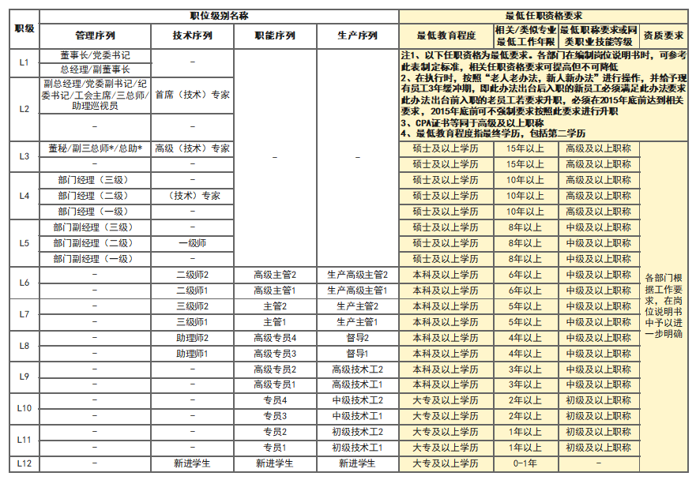
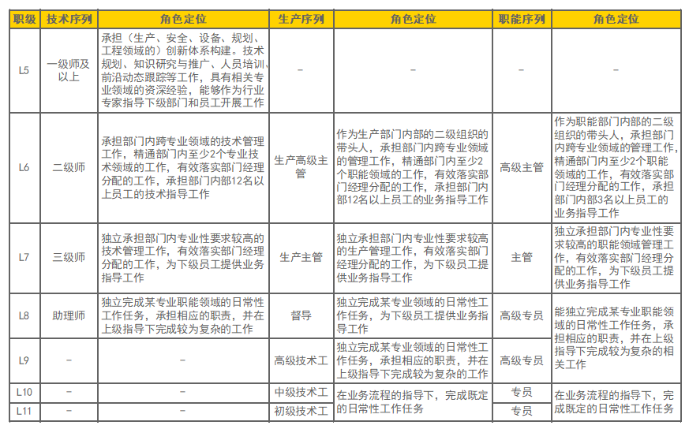

### 【小蜜蜂科技有限公司职位体系管理办法】第一章 总则 - 第一条
为实现小蜜蜂科技有限公司职位管理的科学化、规范化、标准化，切实加强和完善职位管理工作，达到规范职位设置、明确职位职责、确定职位标准、区分职位价值的目的，特制定本办法。

### 【小蜜蜂科技有限公司职位体系管理办法】第一章 总则 - 第二条
职位的定义：职位是组织的最小单位。职位的存在、特征与定义，都是基于组织的战略。职位的设置应以结果为导向，是动态而相对稳定的，属于组织而不属于职位任职者。同一职位可以有数个任职者。

### 【小蜜蜂科技有限公司职位体系管理办法】第一章 总则 - 第三条
职位体系的管理应遵循以下原则：
必要性原则：
- （1）无需不设岗，无需不配人，尽量不设对部门核心职能无增值的职位，原则上不设临时性、季节性或阶段性的工作职位，人岗匹配时，应满足岗位的最低任职资格要求；
- （2）以公司当前的发展阶段和业务需求为基础，并根据公司可预计的发展趋势，做出略高于现状的前瞻性设置。
成长性原则：
- （1）职位体系应具有层次性，能够帮助员工建立正确、清晰的晋升方向；
- （2）鼓励员工通过提升自己的能力、达到下一职级岗位的要求，以实现自身的晋升；
- （3）鼓励部门内部人员的横向调动，鼓励员工学习不同岗位的知识，以培养“复合型”人才。
合理性原则：
- （1）宽幅设岗，在保证工作强度不过高的基础上，确保每个职位具有充足的工作饱满度，且职级越高，越应宽幅设岗；
- （2）合理制定最低任职资格要求，合理配员。
价值化原则：
- （1）职位职级由岗位价值评估确定，每类岗位均有其最低和最高的职级；
- （2）同类职位，职位职级应相对平衡，而非一岗一级；
- （3）职位的价值应通过科学的职位评估工具进行衡量。
市场化原则：
- （1）职位名称设置要市场化；
- （2）每类职位名称的设置应与其所在职级的标准名称保持一致或相类似，以保证职位价值能够通过职位名称予以区分；
- （3）职位名称设置要合规化，以规避公司正式员工和非正式员工间的用人风险。

### 【小蜜蜂科技有限公司职位体系管理办法】第一章 总则 - 第四条
本办法适用于公司的全体员工，但不包括劳务外委人员。

### 【小蜜蜂科技有限公司职位体系管理办法】第二章 组织与职责 - 第五条
职位体系管理的组织体系包括公司的职位体系决策者、职位体系管理的归口部门。

### 【小蜜蜂科技有限公司职位体系管理办法】第二章 组织与职责 - 第六条
职位体系管理决策者为公司党政联席会。具体负责职位管理体系相关设计与优化调整方案的审批，负责与职位体系管理相关的重大决策。

### 【小蜜蜂科技有限公司职位体系管理办法】第二章 组织与职责 - 第七条
人力资源部是公司职位体系管理的归口部门，主要职责包括：
制定并完善公司职位体系管理办法及实施细则；
定期优化设计并调整公司职位体系；
组织开展人岗匹配工作；
组织各部门编写岗位说明书。

### 【小蜜蜂科技有限公司职位体系管理办法】第三章 公司职位体系管理的具体要求 - 第八条
公司职位体系的设计与优化，应严格按照职位体系的设计原则开展。

### 【小蜜蜂科技有限公司职位体系管理办法】第三章 公司职位体系管理的具体要求 - 第九条
公司职位体系共包括四大序列、十二个职级，其设置目的是为了有效引导职工正确的职业发展观，规范职位名称设置，并建立职业发展的多通道。具体设置详见附件三。

### 【小蜜蜂科技有限公司职位体系管理办法】第三章 公司职位体系管理的具体要求 - 第十条
各部门职位体系中的“高级主管”级，其设置目的是为主管级员工提供一个合理的升迁路径，是在主管级职位上新增的一个全新的层级，因此，凡有高级主管级职位设置需求的部门，在部门人数（指在编职工）超过12人时，或业务较为独立、专业性较强、任务较重、有外事特殊需要时，可向公司人力资源部提出设置一个相应职位的申请，人力资源部初审通过后，由党政联席会审议决定是否予以批准。如获批后，可设置该职位。

### 【小蜜蜂科技有限公司职位体系管理办法】第三章 公司职位体系管理的具体要求 - 第十一条
部门经理评估结果为三级、二级的部门，可申请设置2名部门副经理；部门经理评估结果为一级的部门，可申请设置1名部门副经理。

### 【小蜜蜂科技有限公司职位体系管理办法】第四章 人岗匹配 - 第十二条
人岗匹配时，应本着合理、适度的原则进行，原则上不允许出现人员实际能力低于所配岗位要求的现象出现，同时并非所有职位均需配员。

### 【小蜜蜂科技有限公司职位体系管理办法】第四章 人岗匹配 - 第十三条
各部门在进行人岗匹配时，应参考相应的岗位角色定义，并保证所配置人员的基本能力满足公司的最低任职资格。具体操作要求及办法详见附件四、五。

### 【小蜜蜂科技有限公司职位体系管理办法】第四章 人岗匹配 - 第十四条
在执行公司的最低任职资格要求时，按照“老人老办法，新人新办法”进行操作，并给予现有员工3年缓冲期，即此办法出台后入职的新员工必须满足此办法要求；此办法出台前入职的老员工若要求升职，必须在2015年底前达到相关要求，2015年底前可不强制要求按照此要求进行升职。

### 【小蜜蜂科技有限公司职位体系管理办法】第四章 人岗匹配 - 第十五条
各部门的人岗匹配，应严格按照人力资源部确定的定编、定员标准进行。

### 【小蜜蜂科技有限公司职位体系管理办法】第四章 人岗匹配 - 第十六条
为保证高级主管级职位的人岗匹配工作有序、公平开展，所有获批的高级主管级职位，必须进行公开的岗位竞聘，根据竞聘结果，确定所配置的具体人员。

### 【小蜜蜂科技有限公司职位体系管理办法】第四章 人岗匹配 - 第十七条
所有部门提出的人岗匹配方案，需首先提交人力资源部进行初审，同时不允许岗位所配员工的新薪酬体系下的年现金总收入（统一按照所配职级的薪档一估算），与原有年现金总收入相比（比照标准参见初始套薪办法），增幅超过40%的情况出现，否则所配人员需要配置到下一层级的岗位。人岗匹配初稿经过人力资源部审核后，由党政联席会进行讨论修改后方可审批通过。

### 【小蜜蜂科技有限公司职位体系管理办法】第五章 职位说明书 - 第十八条
职位说明书是职位管理的基础性文件。职位说明书的标准版本由人力资源部门负责管理，具体模板请参见附件一。

### 【小蜜蜂科技有限公司职位体系管理办法】第五章 职位说明书 - 第十九条
职位说明书的内容包括：
职位标识：包括职位编号、职位名称、部门名称、汇报上级、编制日期等内容；
职位存在目的：描述职位的核心价值，综述职位工作职责与开展工作的限制条件；
工作环境：描述职位的工作地点、环境等；
最低任职要求：描述胜任职位所需的最低要求，包括教育程度、工作经验、专业资质/职称和专业技能等；
工作职责：按照一定的逻辑关系，并结合重要性程度，列举职位四至八项重要职责，并撰写职责范围、职责描述和工作考核维度。这些职责涵盖了员工绝大部分工作时间，若不完成这些职责，将可能对公司业务或职位工作成果产生严重的影响。职位职责是职位说明书日常维护的主要栏目。

### 【小蜜蜂科技有限公司职位体系管理办法】第六章 职位管理 - 第二十条
人力资源部应定期组织开展公司职位体系的调整与优化工作。由人力资源部收集各部门建议，并进行综合平衡后，提交公司党政联席会进行审批。审批通过后，方可执行。

### 【小蜜蜂科技有限公司职位体系管理办法】第六章 职位管理 - 第二十一条
各部门在确有需要时，可向人力资源部提出职位的新设、更名、废止及修订岗位说明的要求，各部门不可自行进行设置及调整。人力资源部应根据企业的实际需要，并严格参照职位设置原则要求，进行职位设置与调整。相关方案需经党政联席会审批通过后，方可执行。具体申请表详见附件二。

### 【小蜜蜂科技有限公司职位体系管理办法】第七章 附则 - 第二十二条
本办法由人力资源部负责解释，并经由公司党政联席会审批后，颁布实施。

### 【小蜜蜂科技有限公司职位体系管理办法】第七章 附则 - 第二十三条
本办法自发布之日起施行。

### 【小蜜蜂科技有限公司职位体系管理办法】附件 - 附件一：职位说明书标准模板
[点击下载 Word 模板](attachments/附件一：职位说明书标准模板.docx)

**附件说明：**
本附件为小蜜蜂科技有限公司**职位说明书标准模板**的空白 Word 表格。
设计用于全面记录和定义岗位权责，结构如下：
1. **基础职位标识**：职位名称、部门名称、汇报上级、职位编号、编制日期等。
2. **职位存在目的**：概括职位的核心价值。
3. **工作职责及主要考核维度**：列出四至八项重要职责，并分别写明职责范围、具体描述和考核维度。
4. **工作环境及主要工作联系**：包含内部主要联系（部门内、公司内其他部门）和外部主要联系。
5. **最低任职资格要求**：包含最低教育程度及专业、相关工作经验要求、专业资质/职称及核心专业技能。
6. **签字确认区**：包含任职者签字及日期、直接上级核准签字及日期。

### 【小蜜蜂科技有限公司职位体系管理办法】附件 - 附件二：职位调整申请表
[点击下载 Word 模板](attachments/附件二：职位调整申请表.docx)

**附件说明：**
本附件为小蜜蜂科技有限公司**职位调整申请表**的空白 Word 表格。
用于规范各部门内部职位的新设、更名、废止或岗位职责修订的申请，结构如下：
1. **基础申报信息**：申请部门、申请日期。
2. **调整内容与申请理由**：调整申请原由（新增、更名、废止、调整岗位说明等）、具体调整内容说明、调整后的职位名称及职级。
3. **合规确认**：是否已提交所调整职位的职位说明书。
4. **审批流程意见**：包含人力资源部初审意见、公司分管领导意见、党政联席会审批决定。

### 【小蜜蜂科技有限公司职位体系管理办法】附件 - 附件三：小蜜蜂科技有限公司职位体系图

##### 小蜜蜂科技有限公司职位体系职级薪级映射表
| 职级 | 管理序列职位名称 | 技术序列职位名称 | 职能序列职位名称 | 生产序列职位名称 | 对应薪级 |
| :--- | :--- | :--- | :--- | :--- | :---: |
| **L1** | 董事长/党委书记、总经理/副董事长 | - | - | - | 24 - 25 |
| **L2** | 副总经理/党委副书记/纪委书记/工会主席/三总师/助理巡视员 | 首席（技术）专家 | - | - | 23 |
| **L3** | 董秘/副三总师/总助 | 高级（技术）专家 | - | - | 20 - 22 |
| **L4** | 部门经理（三级、二级、一级） | （技术）专家 | - | - | 16 - 19 |
| **L5** | 部门副经理（三级、二级、一级） | 一级师 | - | - | 14 - 15 |
| **L6** | - | 二级师2、二级师1 | 高级主管2、高级主管1 | 生产高级主管2、生产高级主管1 | 12 - 13 |
| **L7** | - | 三级师2、三级师1 | 主管2、主管1 | 生产主管2、生产主管1 | 10 - 11 |
| **L8** | - | 助理师2、助理师1 | 高级专员4、高级专员3 | 督导2、督导1 | 8 - 9 |
| **L9** | - | - | 高级专员2、高级专员1 | 高级技术工2、高级技术工1 | 6 - 7 |
| **L10** | - | - | 专员4、专员3 | 中级技术工2、中级技术工1 | 4 - 5 |
| **L11** | - | - | 专员2、专员1 | 初级技术工2、初级技术工1 | 2 - 3 |
| **L12** | - | 新进学生 | 新进学生 | 新进学生 | 1 |

### 【小蜜蜂科技有限公司职位体系管理办法】附件 - 附件四：公司通用最低任职资格要求

##### 公司通用最低任职资格要求表
| 职级 | 对应序列（管理、技术、职能、生产）职位 | 最低教育程度 | 相关/类似专业最低工作年限 | 最低职称要求或同类职业技能等级 | 资质要求 |
| :--- | :--- | :--- | :--- | :--- | :--- |
| **L3** | 董秘/总助/高级（技术）专家 | 硕士及以上学历 | 15年以上 | 高级及以上职称 | 各部门根据工作需要，在岗位说明书中予以进一步明确 |
| **L4** | 部门经理/（技术）专家 | 硕士及以上学历 | 10年以上 | 高级及以上职称 | 同上 |
| **L5** | 部门副经理/一级师 | 硕士及以上学历 | 8年以上 | 中级及以上职称 | 同上 |
| **L6** | 二级师/高级主管/生产高级主管 | 本科及以上学历 | 6年以上 | 中级及以上职称 | 同上 |
| **L7** | 三级师/主管/生产主管 | 本科及以上学历 | 5年以上 | 中级及以上职称 | 同上 |
| **L8** | 助理师/高级专员/督导 | 本科及以上学历 | 4年以上 | 中级及以上职称 | 同上 |
| **L9** | 高级专员/高级技术工 | 本科及以上学历 | 3年以上 | 中级及以上职称 | 同上 |
| **L10** | 专员/中级技术工 | 大专及以上学历 | 2年以上 | 初级及以上职称 | 同上 |
| **L11** | 专员/初级技术工 | 大专及以上学历 | 1年以上 | 初级及以上职称 | 同上 |
| **L12** | 新进学生 | 大专及以上学历 | 0-1年 | 无 | 同上 |

*注：*
* *CPA证书等同于高级及以上职称*
* *最低教育程度指最终学历，包括第二学历*

### 【小蜜蜂科技有限公司职位体系管理办法】附件 - 附件五：职级角色定位参考

##### 各职级角色定位参考表
| 职级 | 对应技术序列 | 技术序列角色定位 | 对应生产序列 | 生产序列角色定位 | 对应职能序列 | 职能序列角色定位 |
| :--- | :--- | :--- | :--- | :--- | :--- | :--- |
| **L5** | 一级师及以上 | 承担（生产、安全、设备、规划、工程领域的）创新体系构建。技术规划、知识研究与推广、人员培训、前沿动态跟踪等工作，具有相关专业领域的资深经验，能够作为行业专家指导下级部门和员工开展工作 | - | - | - | - |
| **L6** | 二级师 | 承担部门内跨专业领域的技术管理工作，精通部门内至少2个专业技术领域的工作，有效落实部门经理分配的工作，承担部门内部12名以上员工的技术指导工作 | 生产高级主管 | 作为生产部门内部的二级组织的带头人，承担部门内跨专业领域的管理工作，精通部门内至少2个职能领域的工作，有效落实部门经理分配的工作，承担部门内部12名以上员工的业务指导工作 | 高级主管 | 作为职能部门内部的二级组织的带头人，承担部门内跨专业领域的管理工作，精通部门内至少2个职能领域的工作，有效落实部门经理分配的工作，承担部门内部3名以上员工的业务指导工作 |
| **L7** | 三级师 | 独立承担部门内专业性要求较高的技术管理工作，有效落实部门经理分配的工作，为下级员工提供业务指导工作 | 生产主管 | 独立承担部门内专业性要求较高的生产管理工作，有效落实部门经理分配的工作，为下级员工提供业务指导工作 | 主管 | 独立承担部门内专业性要求较高的职能领域管理工作，有效落实部门经理分配的工作，为下级员工提供业务指导工作 |
| **L8** | 助理师 | 独立完成某专业职能领域的日常性工作任务，承担相应的职责，并在上级指导下完成较为复杂的工作 | 督导 | 独立完成某专业领域的日常性工作任务，为下级员工提供业务指导工作 | 高级专员 | 独立完成某专业职能领域的日常性工作任务，承担相应的职责，并在上级指导下完成较为复杂的业务 |
| **L9** | - | - | 高级技术工 | 独立完成某专业领域的日常性工作任务，承担相应的职责，并在上级指导下完成较为复杂的工作 | 高级专员 | 独立完成某专业职能领域的日常性工作任务，承担相应的职责，并在上级指导下完成较为复杂的工作 |
| **L10** | - | - | 中级技术工 | 在业务流程的指导下，完成既定的日常性工作任务 | 专员 | 在业务流程的指导下，完成既定的日常性工作任务 |
| **L11** | - | - | 初级技术工 | 在业务流程的指导下，完成既定的日常性工作任务 | 专员 | 在业务流程的指导下，完成既定的日常性工作任务 |
