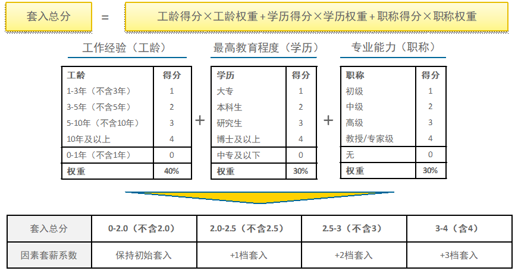

### 【小蜜蜂科技有限公司薪酬管理办法】第一章 总则 - 第一条
为充分发挥薪酬的激励作用，在职位不同的基础上体现员工的贡献及努力程度，对员工为公司付出的劳动和做出的贡献给予激励，根据上级单位劳动管理基本制度，结合小蜜蜂科技有限公司的实际情况，并遵照国家有关法律法规，制定本办法。

### 【小蜜蜂科技有限公司薪酬管理办法】第一章 总则 - 第二条
薪酬管理遵循以下原则：
- （一）为职位付薪原则：根据职位级别确定目标薪酬范围，薪酬与职位价值紧密联系；
- （二）为能力付薪原则：综合任职资格、个人素质等因素，以决定个人固定薪酬在薪酬范围的实际薪酬点，薪酬与个人能力紧密联系；
- （三）为绩效付薪原则：根据职位的固定收入与浮动收入的比例及最终绩效考核结果决定浮动奖金，薪酬与绩效评估结果紧密联系。

### 【小蜜蜂科技有限公司薪酬管理办法】第一章 总则 - 第三条
本办法适用于公司各部门的全体员工，但不包括劳务外委人员。

### 【小蜜蜂科技有限公司薪酬管理办法】第二章 组织与职责 - 第四条
薪酬管理组织体系包括公司的薪酬管理体系决策者和薪酬管理的归口部门。

### 【小蜜蜂科技有限公司薪酬管理办法】第二章 组织与职责 - 第五条
薪酬管理体系决策者为公司党政联席会。
薪酬管理体系决策者负责审定薪酬策略、审批薪酬体系方案以及决策与薪酬管理相关的重要事项。

### 【小蜜蜂科技有限公司薪酬管理办法】第二章 组织与职责 - 第六条
人力资源部是公司薪酬管理的归口部门，主要职责包括：
- （一）编制公司薪酬管理制度及薪酬福利管理办法；
- （二）计算员工薪酬、福利并编制公司员工工资表；
- （三）负责按期发放工资与福利；
- （四）按规定为员工办理各种保险和社会统筹手续；
- （五）负责对薪酬体系进行优化和更新。

### 【小蜜蜂科技有限公司薪酬管理办法】第三章 薪酬体系分类及适用对象 - 第七条
公司薪酬体系包括协议工资制、年薪制和职位工资制三类。

### 【小蜜蜂科技有限公司薪酬管理办法】第三章 薪酬体系分类及适用对象 - 第八条
协议工资制的适用对象以外部招聘的、公司特别急需的、能力素质要求极高且市场人才供给紧缺的专家型人才为主。年薪制的适用对象为公司领导班子成员，职位工资制的适用对象为除公司领导班子成员和适用协议工资制的员工之外的全体员工，但不包括劳务外委人员。

### 【小蜜蜂科技有限公司薪酬管理办法】第四章 协议工资制 - 第九条
设立协议工资制遵循的特殊原则：
- （一）谈判原则：协议工资以市场价格为基础，由双方谈判确定；
- （二）保密原则：为保障员工的顺利工作，对协议工资的人员及其工资严格保密，员工之间禁止相互打探；
- （三）限额原则：协议工资人员数目实行动态管理，依据公司经济效益水平及发展情况限制总数，宁缺毋滥。

### 【小蜜蜂科技有限公司薪酬管理办法】第四章 协议工资制 - 第十条
协议工资制人才的付薪标准，可在市场同类人才合理的薪酬标准基础上，由双方友好协商确定。一般以雇员原有薪酬作为谈判基础，涨幅在30%-50%间，同时需对方出具原有公司的工资单、税单、银行对账单，以证明其原有收入水平。

### 【小蜜蜂科技有限公司薪酬管理办法】第四章 协议工资制 - 第十一条
协商后的年薪，原则上不应超过员工所在职级最高年现金收入标准的两倍。

### 【小蜜蜂科技有限公司薪酬管理办法】第四章 协议工资制 - 第十二条
协议工资制人才应与公司单独签订劳动合同，标明协议工资水平，个税的扣除方式和标准与其他员工一致。其员工绩效考核及绩效奖金管理办法参考同职级员工。

### 【小蜜蜂科技有限公司薪酬管理办法】第四章 协议工资制 - 第十三条
协议工资制人才的退出：实行协议工资的人才，年底根据劳动合同进行年度考核。有以下情况者自动退出：
- （一） 考核总分低于预定标准；
- （二）人才供求关系变化，不再是市场稀缺人才。

### 【小蜜蜂科技有限公司薪酬管理办法】第五章 年薪制 - 第十四条
年薪制仅适用于公司领导班子成员，其年薪按照上级单位相关规定执行。

### 【小蜜蜂科技有限公司薪酬管理办法】第六章 职位工资制 - 第十五条
公司薪酬体系以职位工资制为主体，共分为21个薪酬等级，对应职位评估结果为L3-L12职级的职位。该薪酬等级体系是在职位序列及职位等级体系的基础上，经过职位等级转换形成。职位等级是通过使用国际通用的职位评估工具进行评估的结果。职位等级反映了职位之间的相对价值关系，级别高的职位其价值更高。

### 【小蜜蜂科技有限公司薪酬管理办法】第六章 职位工资制 - 第十六条
公司职位工资制的组成包括：基本薪酬、津补贴、绩效奖金、企业年金、社会保障及福利等五部分，其中总现金收入包括基本薪酬、津补贴、安全绩效奖金和个人绩效奖金。

### 【小蜜蜂科技有限公司薪酬管理办法】第六章 职位工资制 - 第十七条
为了体现不同薪酬级别职位的工作重要性差异，职位工资制薪酬体系规定了不同薪酬级别职位的薪酬固浮比（基本薪酬：安全绩效奖金：个人绩效奖金）。职级为L7-L12的员工，其薪酬固浮比为50%：30%：20%；职级为L3-L6的员工，其薪酬固浮比为45%：30%：25%。由于津补贴数额较小，因此不在薪酬固浮比的考虑范围之内。

### 【小蜜蜂科技有限公司薪酬管理办法】第六章 职位工资制 - 第十八条
各个薪酬等级对应的总现金收入分为9档，级别下限为薪酬入档线，级别上限为薪酬封顶线，中点为该薪酬等级基准点。总现金收入水平由人力资源部规定并定期更新。

### 【小蜜蜂科技有限公司薪酬管理办法】第六章 职位工资制 - 第十九条
基本薪酬：基本薪酬与职位价值评估结果挂钩，不同职位根据职级的不同，有不同的基本薪酬。职级越高，基本薪酬越高，体现为岗付薪的理念，以此鼓励员工多学习、多晋升。各个薪酬等级的基本薪酬同样对应分为9档，每月按时发放。基本薪酬水平由人力资源部规定并定期更新。

### 【小蜜蜂科技有限公司薪酬管理办法】第六章 职位工资制 - 第二十条
安全绩效奖金：安全绩效奖金的标准与薪级挂钩，每级分为9档，其发放标准与公司发生重大人身伤亡事故挂钩。在未出现安全责任事故时每月全额按时发放。在出现安全责任事故时，直接责任员工和领导的当月安全绩效奖金全部扣除，间接责任员工和领导的当月安全绩效奖金扣除50%。安全绩效奖金水平由人力资源部规定并定期更新。

### 【小蜜蜂科技有限公司薪酬管理办法】第六章 职位工资制 - 第二十一条
个人绩效奖金：员工个人绩效奖金=个人目标绩效奖金×部门绩效系数×个人绩效系数×公司绩效奖金调整系数。其中公司绩效奖金调整系数用于调节上级单位实发绩效奖金与公司应发绩效奖金间的差异；部门绩效系数与部门年终平衡计分卡打分情况挂钩，部门得分实行强制分布；个人绩效系数与部门正副领导对员工个人的综合绩效评价挂钩，员工得分同样实行强制分布。绩效奖金根据绩效周期每年发放一次，发放的详细办法见《小蜜蜂科技有限公司员工绩效管理办法》。目标绩效奖金水平由人力资源部规定并定期更新。

### 【小蜜蜂科技有限公司薪酬管理办法】第六章 职位工资制 - 第二十二条
津补贴：津补贴的发放目的，是为了调节基本薪酬和安全绩效奖金所无法实现的差异化因素，公司发放的津补贴范围由人力资源部另行发文规定。

### 【小蜜蜂科技有限公司薪酬管理办法】第六章 职位工资制 - 第二十三条
社会保障及福利：员工的社会保障金、企业年金将根据国家、地方政府和上级单位总部的有关政策进行发放和计提。

### 【小蜜蜂科技有限公司薪酬管理办法】第六章 职位工资制 - 第二十四条
除以上内容外，公司还对于有特殊贡献的员工和集体给予定期或不定期的单项奖励，具体奖励内容由人力资源部另行规定。

### 【小蜜蜂科技有限公司薪酬管理办法】第七章 职位工资制薪酬套入办法 - 第二十五条
对于新入职员工、职位或职级进行大幅度调整的员工，其付薪标准需要根据此办法进行套入后，再予以付薪。

### 【小蜜蜂科技有限公司薪酬管理办法】第七章 职位工资制薪酬套入办法 - 第二十六条
职位价值决定员工对应的薪级，因此每个职位的员工会对应一个薪级，每个薪级有9个薪档，员工自身特质决定员工对应的薪档，不同层级的薪档，能够体现不同员工的个人素质，并保证员工在职位上具有较宽广的薪酬成长空间。

### 【小蜜蜂科技有限公司薪酬管理办法】第七章 职位工资制薪酬套入办法 - 第二十七条
套薪的基本原则
- （一）所有员工的初始套薪薪档为薪档一，并根据《因素套薪系数计算表》（见下表），计算确定最终的套薪薪档（综合行政专员统一套入薪档一不增档；设备维修部门的翻车机维修三级师/助理师统一由薪档五套入；堆料机操控员最高可套入到第8档，翻车机操控员最高可套入到第7档）；

#### 因素套薪系数计算表（结构化说明）

**计算公式：**
$$套入总分 = 工龄得分 \times 40\% + 学历得分 \times 30\% + 职称得分 \times 30\%$$

**评分标准：**
| 得分 | 工作经验（工龄，权重 40%） | 最高教育程度（学历，权重 30%） | 专业能力（职称，权重 30%） |
| :---: | :--- | :--- | :--- |
| **4** | 10年及以上 | 博士及以上 | 教授/专家级 |
| **3** | 5-10年（不含10年） | 研究生 | 高级 |
| **2** | 3-5年（不含5年） | 本科生 | 中级 |
| **1** | 1-3年（不含3年） | 大专 | 初级 |
| **0** | 0-1年（不含1年） | 中专及以下 | 无 |

**套薪系数对照表：**
| 套入总分 | 因素套薪系数 |
| :--- | :--- |
| 0-2.0 (不含2.0) | 保持初始套入 |
| 2.0-2.5 (不含2.5) | +1档套入 |
| 2.5-3 (不含3) | +2档套入 |
| 3-4 (含4) | +3档套入 |
- （二）套薪的比照标准为为过去一年员工标准岗位工资计算所得收入，包括各月岗位工资和全员享有的单项奖，部门奖、津补贴不涵盖在内；
- （三）套薪后，应保证所有员工目前的现金总收入不降低（比照标准参考原则二），如果出现新套入薪档标准低于目前的现金总收入，则根据“就近就高原则”，确定最终的薪档；
- （四）原则四：高出最高档位（第9档）的员工进行薪酬冻结，即最高套入为已确定薪级的薪档9。

### 【小蜜蜂科技有限公司薪酬管理办法】第八章 公司及员工年度调薪办法 - 第二十八条
年度调薪的目的，是对因经济环境和劳动力市场变动引起的市场变化做出回应，并对员工基于绩效和能力增长而获得调薪的机会进行评估。年度调薪具体包括公司整体薪酬体系年度调整和个人薪酬年度调整。

### 【小蜜蜂科技有限公司薪酬管理办法】第八章 公司及员工年度调薪办法 - 第二十九条
公司薪酬体系年度调整的具体实施细则为：在每年的年底，由人力资源部收集已过去一年的市场物价变化指数、当地居民可支配收入变化指数、人才市场付薪水平变化指数；取三大指数中最大的一个，作为年度调薪的依据，向上级单位提出整体薪酬水平调整申请；待审批通过，按照审批通过的薪酬增长比例，对原有薪酬表的薪酬数据进行统一调整后执行 。

### 【小蜜蜂科技有限公司薪酬管理办法】第八章 公司及员工年度调薪办法 - 第三十条
个人薪酬年度调整的具体实施细则为：
- （一）绩效考评成绩为“良好”和“称职”的员工，每年在原薪等基础上，提升一个薪等；
- （二）员工绩效考评分为“优秀”，则提升两个薪等；
- （三）员工绩效考评连续两年为“优秀”，则可提升一个薪级；
- （四）薪等最多可调整到第9档。若员工一直未升职，则只能按照当年最新调整后的薪酬表，执行第9等的薪酬，而不能继续增加；
- （五）生产序列中，堆料机操控员最高可调整到第8档，翻车机操控员最高可调整到第7档；
- （六）员工年度正常升职（非调动升职）后，首先应确定新职级中与其原薪酬水平相近的薪档（就近就高原则），随后可在新职级中为其再增长一个薪档。

### 【小蜜蜂科技有限公司薪酬管理办法】第九章 岗位变动员工调薪办法 - 第三十一条
换岗调薪分位三种情况分别进行处理：调动后职位提升、调动后职位降低和平级调动。不包括年度正常升职。

### 【小蜜蜂科技有限公司薪酬管理办法】第九章 岗位变动员工调薪办法 - 第三十二条
员工调动后职位提升：如果当前年现金总收入超过新薪级下的薪档一，则执行新薪级下的同等薪档；如果当前年现金总收入达不到新薪级下的薪档一，则执行新薪级下的薪档一。调整后的薪酬标准于入职后次月执行。调动后的当年奖金仍执行调动前的标准，直至下一年的绩效考核循环开始，方执行新标准。

### 【小蜜蜂科技有限公司薪酬管理办法】第九章 岗位变动员工调薪办法 - 第三十三条
如果当前年现金总收入超过新薪级下的薪档九，则执行新薪级下的薪档九；如果当前年现金总收入达不到新薪级下的薪档九，则执行新薪级下的同等薪档。调整后的薪酬标准于入职后次月执行。调动后的当年奖金仍执行调动前的标准，直至下一年的绩效考核循环开始，方执行新标准。

### 【小蜜蜂科技有限公司薪酬管理办法】第九章 岗位变动员工调薪办法 - 第三十四条
如员工进行平级调动，平级调动的当年，薪酬水平均不予调整；在年底时，根据公司相关年度调薪规定，执行相应的调薪操作。

### 【小蜜蜂科技有限公司薪酬管理办法】第十章 薪酬发放管理 - 第三十五条
非新进学生薪酬发放标准：
- （一）对于调入及新招聘的有经验员工，在试用期内，每月发放固定基本薪酬及安全绩效奖金，发放标准为其所在薪级薪档一的80%；
- （二）试用期满后，如果任职人员达到所在职位的最低任职资格，则最终定薪标准根据《员工初始薪酬套入办法》确定；
- （三）试用期满后，如果任职人员尚未达到所在职位的最低任职资格，则按照其所在薪级薪档一的90%发放薪酬，直至其达到相关岗位的最低任职资格要求；
- （四）在年终计算绩效奖金时，入职未满半年的非新进学生员工，按月折算后发放其目标绩效奖金的50%，同时不参加当年的部门绩效考核，不计入部门绩效强制分布人数；入职满半年的非新进学生员工，按月折算后确定其目标绩效奖金，同时参加当年的部门绩效考核并记入部门绩效强制分布人数。

### 【小蜜蜂科技有限公司薪酬管理办法】第十章 薪酬发放管理 - 第三十六条
新进学生薪酬发放标准：
- （一）对于新进员工（包括各大中专院校、技校、大学生村官等），其第一年的薪酬参照新进员工薪级进行确定。在试用期内，每月发放固定基本薪酬及安全绩效奖金，发放标准为新进员工薪级-薪档一的30%；
- （二）试用期满但入职未满一年，每月发放固定基本薪酬及安全绩效奖金，发放标准为新进员工薪级-薪档一；
- （三）入职满一年后，如果任职人员达到所在职位的最低任职资格，则最终定薪标准根据《员工初始薪酬套入办法》确定；
- （四）入职满一年后，如果任职人员尚未达到所在职位的最低任职资格，则按照其所在薪级薪档一的90%发放薪酬，直至其达到相关岗位的最低任职资格要求；
- （五）在年终计算绩效奖金时，入职未满半年的新进学生员工，按月折算后发放其目标绩效奖金的30%，同时不参加当年的部门绩效考核，不计入部门绩效强制分布人数；入职满半年的新进学生员工，按月折算后确定其目标绩效奖金，同时参加当年的部门绩效考核并记入部门绩效强制分布人数。

### 【小蜜蜂科技有限公司薪酬管理办法】第十章 薪酬发放管理 - 第三十七条
一般员工薪酬发放与扣除办法：
- （一）一般员工的基本薪酬与安全绩效奖金均按月发放，每年共发放12个月，与职级挂钩；年度绩效奖金每年发放一次，具体发放办法参看《小蜜蜂科技有限公司员工绩效管理办法》；
- （二）加班工资支付标准：各单位应严格控制加班人员，除特殊情况必须加班的，其他人员一律不得加班。特殊情况下员工加班的，公司实行加班缓休；
- （三）缺勤扣薪标准：公司鼓励员工间进行适度调休，以保障员工的家庭及生活基本需要。但若员工当月工作时间未满足国家相关法定要求，则按照实际缺勤天数，扣除50%的基本薪酬和全部的安全绩效奖金；年度目标绩效奖金相应地也应予以扣除；
- （四）病假扣薪标准：员工全年的病假在5天以内的，不扣发薪酬；在5天及以上的，按实际超过天数，扣发相应的安全绩效奖金和个人绩效奖金，但基本薪酬照发，同时需要员工提供相应的医生证明及相关病历；
- （五）正常的婚假、丧假、带薪休假，各项薪酬不停发；
- （六）正常的产假，不扣除基本薪酬，同时按照实际请假天数，支付60%的安全绩效奖金，但不支付个人绩效奖金；女员工产假期满后，因身体原因不能工作的，经公司分管领导批准续假的，月基本薪酬按正常的60%发放，但不支付安全绩效奖金和个人绩效奖金；
- （七）无故旷工一天，扣减月基本薪酬和安全绩效奖金的10%；旷工两天，扣减月基本薪酬和安全绩效奖金的20%；按次类推，直至月基本薪酬和安全绩效奖金扣除完毕。同时当月的现金津补贴不予发放；年度目标绩效奖金相应地也应予以扣除；
- （八）待岗员工的薪酬发放标准按照《小蜜蜂科技有限公司人力资源配置管理办法（试行）》确定。

### 【小蜜蜂科技有限公司薪酬管理办法】第十章 薪酬发放管理 - 第三十八条
部门工资总额的核算与调整：
- （一）公司鼓励各部门通过提高人员能力而非提高人员数量的方式，提供工作效率；
- （二）部门内人岗能够全部匹配，按照人岗匹配后的员工年现金总收入进行汇总确定工资总额；如部门内有缺员，则按照缺员职位所对应的薪级中的薪档一的80%计提，作为部门的年终额外奖励，由部门经理在部门内部进行二次分配；
- （三）部门人数如果超员，则超员人员的薪酬发放标准为其人岗匹配后所确定的薪级薪档标准的80%，相应的年终目标绩效奖金也按照80%的比例进行折算。

### 【小蜜蜂科技有限公司薪酬管理办法】第十二章 附则 - 第三十九条
本办法由人力资源部负责解释，经职代会审议通过并报上级单位审批后颁布实施。

### 【小蜜蜂科技有限公司薪酬管理办法】第十二章 附则 - 第四十条
本办法自发布之日起施行。
