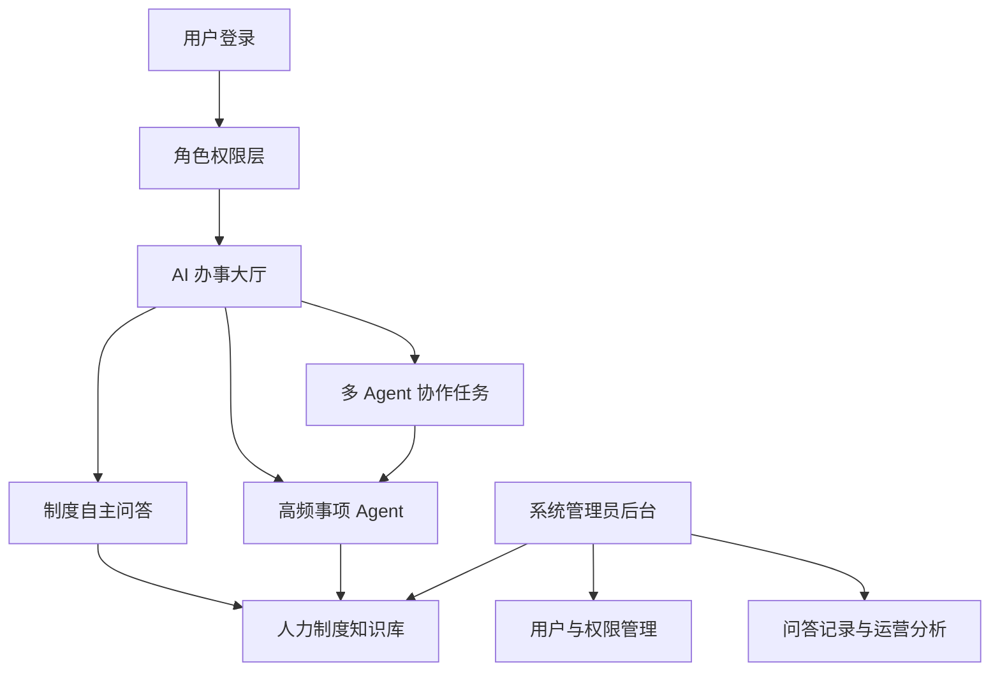

# HR Copilot 企业人力制度智能助手：产品蓝图

## 产品定位

打造一个面向企业人力制度的 AI 办事助手 Demo。它不是简单的文档搜索工具，而是逐步从“回答制度问题”演进到“协助办理事项”，最终展示多个专业助手协同处理复杂任务。

暂定产品名：**HR Copilot 企业人力制度智能助手**

## 产品形态选择

### 方案一：知识问答型

核心是 RAG 问答、制度引用和权限控制。容易落地，但 Agent 亮点不足。

### 方案二：AI 办事大厅型（推荐）

首页同时提供自由问答和办事入口。用户既可以询问制度，也可以选择具体事项，由 Agent 引导完成任务。适合做可操作 Demo，也方便逐步扩展。

### 方案三：多 Agent 工作台型

强调多个 Agent 的分工和协作，技术展示效果强，但如果过早加入，容易显得复杂且缺少真实业务支撑。

建议采用第二种：以 RAG 为底座，以办事入口为产品外壳，逐步加入 Agent。

## 整体架构

## 用户角色

| 角色 | 主要需求 | 演示重点 |
| --- | --- | --- |
| 员工 | 快速了解与自己相关的制度，获得办事指引 | 通俗回答、制度出处、关联问题、办事入口 |
| HR 专员 | 更准确地解释制度、处理复杂咨询 | 跨文档检索、原文定位、专业建议、记录追溯 |
| 系统管理员 | 维护知识库和权限，观察产品使用情况 | 文档管理、角色权限、问答记录、数据看板 |

## 核心产品模块

### 1. 登录与角色切换

展示不同角色看到的功能、知识范围和回答深度不同。

### 2. 制度自主问答

支持自然语言提问、连续追问、答案引用、原文定位、关联制度推荐。

回答中明确区分：制度原文、AI 解读、需要 HR 确认的事项。

### 3. AI 办事大厅

将高频问题包装成卡片式入口。每个入口未来可以对应一个 Agent。

当前先保留整体结构，不立即确定具体场景。

### 4. Agent 办理空间

用户进入某个事项后，Agent 主动询问必要信息，调用相关制度，生成判断结果、流程说明或材料清单。

这是第二阶段的重点。

### 5. 多 Agent 协作空间

面向跨制度、跨环节任务，由一个协调 Agent 拆解问题，再交给多个专业 Agent 处理。

这是第三阶段的展示亮点，不建议作为首版开发范围。

### 6. 系统管理后台

包括制度文档管理、知识库更新、角色权限配置、问答记录、用户反馈和常见问题统计。

## 与普通聊天机器人的差异

- 每条关键结论都有制度依据，可以打开原文核对。
- 不同角色获得不同的信息范围和表达方式。
- 不确定时不会强行回答，而是提示需要 HR 确认。
- 从“告诉用户规则”逐步升级到“协助用户办事”。
- 管理员可以持续更新制度、发现高频咨询并优化 Agent。

## 分阶段路线

| 阶段 | 产品能力 | Demo 重点 |
| --- | --- | --- |
| 第一阶段 | 制度 RAG 问答 + 角色权限 + 管理后台 | 回答准确、引用可追溯、不同角色体验不同 |
| 第二阶段 | 若干高频事项 Agent | Agent 主动引导、跨制度检索、输出可执行结果 |
| 第三阶段 | 一个多 Agent 协作场景 | 任务拆解、专业分工、协作过程可视化 |

