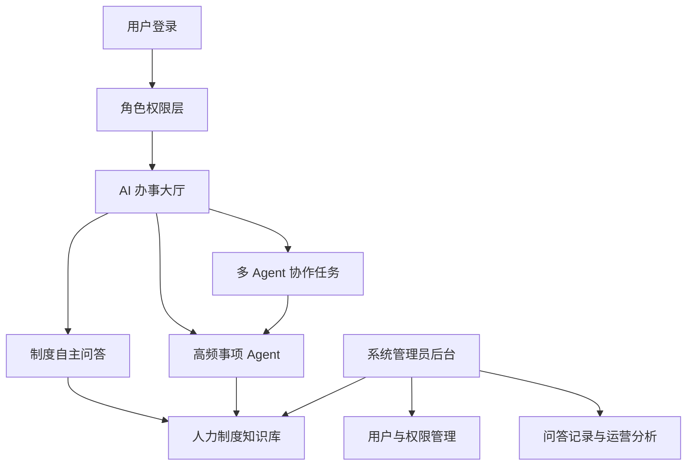

# HR Copilot 企业人力制度智能助手：产品蓝图

## 产品定位

打造一个面向企业人力制度的 AI 办事助手 Demo。它不是简单的文档搜索工具，而是逐步从“回答制度问题”演进到“协助办理事项”，最终展示多个专业助手协同处理复杂任务。

暂定产品名：**HR Copilot 企业人力制度智能助手**

## 产品形态选择

### 方案一：知识问答型

核心是 RAG 问答、制度引用和权限控制。容易落地，但 Agent 亮点不足。

### 方案二：AI 办事大厅型（推荐）

首页同时提供自由问答和办事入口。用户既可以询问制度，也可以选择具体事项，由 Agent 引导完成任务。适合做可操作 Demo，也方便逐步扩展。

### 方案三：多 Agent 工作台型

强调多个 Agent 的分工和协作，技术展示效果强，但如果过早加入，容易显得复杂且缺少真实业务支撑。

建议采用第二种：以 RAG 为底座，以办事入口为产品外壳，逐步加入 Agent。

## 整体架构

## 用户角色

| 角色 | 主要需求 | 演示重点 |
| --- | --- | --- |
| 员工 | 快速了解与自己相关的制度，获得办事指引 | 通俗回答、制度出处、关联问题、办事入口 |
| HR 专员 | 更准确地解释制度、处理复杂咨询 | 跨文档检索、原文定位、专业建议、记录追溯 |
| 系统管理员 | 维护知识库和权限，观察产品使用情况 | 文档管理、角色权限、问答记录、数据看板 |

## 核心产品模块

### 1. 登录与角色切换

展示不同角色看到的功能、知识范围和回答深度不同。

### 2. 制度自主问答

支持自然语言提问、连续追问、答案引用、原文定位、关联制度推荐。

回答中明确区分：制度原文、AI 解读、需要 HR 确认的事项。

### 3. AI 办事大厅

将高频问题包装成卡片式入口。每个入口未来可以对应一个 Agent。

当前先保留整体结构，不立即确定具体场景。

### 4. Agent 办理空间

用户进入某个事项后，Agent 主动询问必要信息，调用相关制度，生成判断结果、流程说明或材料清单。

这是第二阶段的重点。

### 5. 多 Agent 协作空间

面向跨制度、跨环节任务，由一个协调 Agent 拆解问题，再交给多个专业 Agent 处理。

这是第三阶段的展示亮点，不建议作为首版开发范围。

### 6. 系统管理后台

包括制度文档管理、知识库更新、角色权限配置、问答记录、用户反馈和常见问题统计。

## 与普通聊天机器人的差异

- 每条关键结论都有制度依据，可以打开原文核对。
- 不同角色获得不同的信息范围和表达方式。
- 不确定时不会强行回答，而是提示需要 HR 确认。
- 从“告诉用户规则”逐步升级到“协助用户办事”。
- 管理员可以持续更新制度、发现高频咨询并优化 Agent。

## 分阶段路线

| 阶段 | 产品能力 | Demo 重点 |
| --- | --- | --- |
| 第一阶段 | 制度 RAG 问答 + 角色权限 + 管理后台 | 回答准确、引用可追溯、不同角色体验不同 |
| 第二阶段 | 若干高频事项 Agent | Agent 主动引导、跨制度检索、输出可执行结果 |
| 第三阶段 | 一个多 Agent 协作场景 | 任务拆解、专业分工、协作过程可视化 |

## MVP 范围

MVP 选择：**完整 RAG MVP**。

第一版先做制度问答、引用溯源、角色权限和基础后台，不做 Agent、多 Agent 和业务审批流。

## MVP 功能

### 员工端

- 预设员工账号登录。
- 进行人力制度自然语言问答。
- 查看回答、制度引用和原文片段。
- 支持连续追问。
- 对答案反馈“有帮助”或“需要 HR 确认”。

### HR 专员端

- 预设 HR 账号登录。
- 进行制度问答。
- 查看更完整的制度依据和跨文档引用。
- 查看员工提交的“需要 HR 确认”问题。
- 标记处理状态。

### 系统管理员端

- 查看制度文档列表。
- 上传、启用或停用制度文档。
- 查看问答记录和反馈统计。
- 查看预设角色权限。

## MVP 关键页面

1. 登录页
2. AI 制度问答主页
3. 制度引用详情页或侧边栏
4. HR 待确认问题列表
5. 系统管理员后台

## MVP 暂不做

- 请假、入职等业务表单。
- 自动发起审批。
- 企业系统对接。
- 复杂权限编辑。
- Agent 工作流。
- 多 Agent 协作。
- 大量数据看板。

## MVP 演示脚本

1. 员工登录，询问：“我入职半年，可以休年假吗？”
2. 系统回答，并展示制度引用和原文片段。
3. 员工追问：“如果离职时还有年假怎么办？”
4. 系统检索相关规则；如果制度没有明确覆盖，提示需要 HR 确认。
5. 员工提交确认请求。
6. 切换到 HR 账号，查看该问题和相关制度依据。
7. 切换到管理员账号，展示知识库文档和问答统计。

## MVP 验收标准

- 准备 20 至 30 个常见制度问题作为测试集。
- 大部分回答能够引用正确制度。
- 引用内容可以定位到原文片段。
- 制度没有明确答案时，系统能够说明不确定性。
- 三种角色看到的功能范围有明显差异。
- 整个演示可以在 5 分钟内顺畅完成。

第二阶段再从真实高频问题中挑选一个值得使用 Agent 的事项，而不是为了展示 Agent 预设一个场景。
