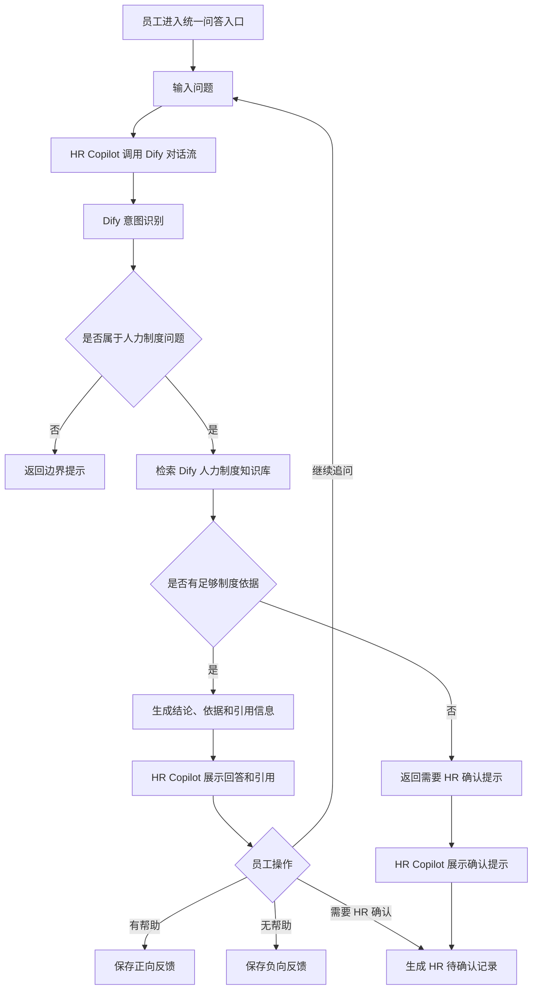

# 【PRD】v1.0 制度 RAG 问答与基础管理后台

## 一、文档说明

| 字段 | 内容 |
| --- | --- |
| 文档名称 | 【PRD】V1.0 制度 RAG 问答与基础管理后台 |
| 产品名称 | HR Copilot 企业人力制度智能助手 |
| 产品版本 | V1.0 |
| 文档版本 | V0.1 |
| 文档状态 | 草稿 |
| 适用范围 | V1.0 MVP 产品设计、需求评审、研发排期、测试验收 |
| 核心范围 | 制度 RAG 问答、引用溯源、角色权限、基础管理后台 |

本文档用于定义 HR Copilot V1.0 的产品范围、用户角色、核心流程和功能要求。V1.0 作为产品首个上线版本，重点验证制度问答的准确性、可信度和可追溯性。

### 1.1 版本记录

| 文档版本 | 产品版本 | 日期 | 状态 | 变更说明 |
| --- | --- | --- | --- | --- |
| V0.1 | V1.0 | 2026-06-03 | 草稿 | 创建 V1.0 PRD 初稿，定义文档结构、产品目标、角色、MVP 范围和核心业务流程。 |


## 二、项目背景

企业内部人力制度通常分散在多份制度文件中，覆盖聘用、劳动合同、考勤休假、薪酬、绩效、培训、职业发展、社保公积金、人事档案等多个主题。员工在查询制度时，常见问题包括：

- 不知道应该查看哪份制度。
- 能找到制度原文，但难以快速理解适用规则。
- 同一问题可能涉及多份制度，人工判断成本较高。
- 口头咨询和人工答复难以沉淀，HR 重复解答压力较大。
- 制度调整后，旧答复、旧理解可能继续传播。

公司已沉淀多份人力制度文件，但制度内容主要以文档形式保存，缺少统一、便捷、可追溯的查询入口。员工咨询依赖人工咨询，HR专员对于高频问题需要重复解答，系统管理员也缺少对制度知识库使用情况的基础观察与知识库状态管理。

**V1.0 通过 RAG 问答能力，将人力制度文档转化为可检索、可引用、可追溯的知识服务。**产品面向员工、HR 专员和系统管理员三类角色，先解决制度查询、制度解释、引用溯源和知识库基础维护问题，为后续agent设计打基础。


## 三、产品目标

V1.0 的目标是基于 Dify 上线制度 RAG 问答与基础管理后台，验证以下能力：

1. 员工可以用自然语言查询人力制度，并获得清晰、可信的回答。
2. 回答必须展示制度来源和原文片段，支持用户追溯依据。
3. 系统能够支持用户的连续追问，保持上下文理解。
4. 当问题缺少明确制度依据无法回答时，系统能够提示不确定性，并引导员工提交HR确认。
5. HR专员可以查看员工提交的待确认问题，并基于制度依据进行处理。
6. 系统管理员可以查看制度知识库状态、问答记录和反馈统计，支撑知识库运营管理。
7. 员工、HR专员、系统管理员三类角色在功能入口和信息展示上有明确差异。

V1.0 不以替代 HR 最终判断为目标，也不直接处理审批、请假、入职等业务流转。V1.0 的核心是把制度查询和制度解释做好，为后续事项办理助手和跨场景协同能力提供基础。


## 四、用户角色与核心场景

### 4.1 员工

员工是制度问答的主要使用者。员工希望快速了解与自身相关的人力制度，例如考勤休假、薪酬福利、培训、绩效、职业发展等。

核心场景：

- 查询某项制度规则，例如“入职半年可以休年假吗？”
- 对回答继续追问，例如“如果离职时还有年假怎么办？”
- 查看回答引用的制度名称和原文片段。
- 当系统提示制度依据不足而无法回答时，提交至HR专员处。
- 对回答结果进行反馈，例如“有帮助”或“无帮助”或“需要 HR 确认”。

### 4.2 HR 专员

HR 专员负责处理员工制度咨询和待确认问题。HR 专员需要看到更完整的制度依据，辅助判断问题是否可直接按制度解释，或需要进一步人工处理。

核心场景：

- 使用问答入口检索制度内容。
- 当系统回答内容有问题时，及时记录下问题。
- 查看员工提交的“需要 HR 确认”问题。
- 标记待确认问题的处理状态。
- 根据问答记录和反馈识别高频咨询主题并记录。

### 4.3 系统管理员

系统管理员负责查看知识库状态和基础运营数据。知识库相关内容处理需要先在本地进行再上传至dify知识库完成托管和索引。HR Copilot 后台不直接承担原始文档分块能力，只提供知识库状态和使用记录的管理视图。

核心场景：

- 查看已接入的制度知识库文档列表。
- 查看文档预处理状态、Dify 同步状态和更新时间。
- 查看知识库文档启用或停用状态。
- 控制知识库文档的启用和停用。
- 查看问答记录和反馈统计。
- 查看预设角色权限。


## 五、V1.0 MVP 范围

### 5.1 版本定位

V1.0 定位为 **制度 RAG 问答与基础管理后台**。

本版本优先解决员工制度查询、HR 辅助确认、知识库状态管理和基础运营观察问题。V1.0 不承载完整人事业务办理，不直接发起审批，也不建设复杂 Agent 工作流。

### 5.2 V1.0 需要做

#### 5.2.1 员工端

- 预设员工账号登录。
- 进行人力制度自然语言问答。
- 查看回答、制度引用和原文片段。
- 支持连续追问。
- 对答案反馈“有帮助”“无帮助”或“需要 HR 确认”。
- 当系统无法给出明确答案时，可以提交至 HR 专员确认。

#### 5.2.2 HR 专员端

- 预设 HR 账号登录。
- 进行制度问答。
- 查看更完整的制度依据、原文片段和跨文档引用。
- 查看员工提交的“需要 HR 确认”问题。
- 标记问题处理状态。
- 记录系统回答存在的问题，用于后续优化知识库和问答策略。

#### 5.2.3 系统管理员端

- 查看已接入的制度知识库文档列表。
- 查看文档预处理状态、Dify 同步状态和更新时间。
- 查看文档启用或停用状态。
- 控制知识库文档启用或停用。
- 查看问答记录和反馈统计。
- 查看预设角色权限。

#### 5.2.4 AI 能力

- 基于 Dify 知识库进行制度 RAG 检索和回答。
- 回答中展示引用制度名称和原文片段。
- 支持上下文追问。
- 对低置信度或无明确依据的问题给出提示。

#### 5.2.5 知识库建设方式

- V1.0 采用“本地人工预处理 + Dify 知识库托管 + HR Copilot 管理视图”的知识库建设方式。
- 原始制度文档需先在本地完成清洗、人工分块、标题补充和数据标注。
- 标准化知识片段上传至 Dify 后，由 Dify 完成知识库托管、索引和检索。
- HR Copilot 不提供原始文档在线分块功能，只展示知识库文档状态、启停状态和使用记录。

### 5.3 V1.0 暂不做

- 不做请假、入职、调岗等具体人事业务办理和审批流。
- 不做企业微信、OA、HRIS 等外部系统对接。
- 不做原始制度文档的在线清洗、自动分块和在线编辑。
- 不做 Agent 工作流、多 Agent 协作和复杂数据看板。
- 不做复杂权限配置，只保留预设角色权限。

### 5.4 V1.0 成功标准

#### 5.4.1 北极星指标

制度问答有效解决率：员工提出制度问题后，无需人工介入即可获得可采信答案的比例。

计算口径：

```text
制度问答有效解决率 = 有帮助反馈数量 / 员工制度问答总反馈数量
```

**V1.0 目标值：不低于 70%。**

#### 5.4.2 核心质量指标

| 指标 | 口径 | V1.0 目标 |
| --- | --- | --- |
| 回答准确率 | 在预设测试问题集中，回答结论与制度规则一致的比例 | 不低于 80% |
| 引用准确率 | 回答引用的制度文件和原文片段能够支撑回答结论的比例 | 不低于 85% |
| 引用覆盖率 | 有明确制度依据的回答中，展示制度名称和原文片段的比例 | 100% |
| 无依据识别率 | 对制度库中无明确依据的问题，系统识别为无法确定或需 HR 确认的比例 | 不低于 90% |
| 追问理解准确率 | 连续追问场景中，系统能够结合上下文给出正确回答的比例 | 不低于 80% |
| 严重幻觉率 | 回答中出现与制度相冲突、但被表达为确定结论的比例 | 不高于 5% |

#### 5.4.3 功能验收标准

- 员工可以完成制度提问、查看引用、连续追问、提交 HR 确认。
- HR 专员可以查看待确认问题，并完成处理状态标记。
- 系统管理员可以查看知识库文档状态、控制文档启停，并查看问答记录和反馈统计。
- 系统在无明确制度依据时，不输出确定性结论，并引导用户提交 HR 确认。

## 六、核心业务流程

> 本章先定义 V1.0 的核心流程结构。员工制度问答流程需要同时描述用户在 HR Copilot 中的操作路径，以及 Dify 对话流内部的 AI 处理路径；HR 和系统管理员流程以用户操作、系统处理和状态流转为主，不强行拆成 AI 旅程。

### 6.1 员工制度问答流程

员工制度问答流程是 V1.0 的核心流程。该流程由 HR Copilot 前端交互和 Dify 对话流共同完成：

- HR Copilot 负责用户登录、角色识别、问答入口展示、调用 Dify、展示回答和引用、展示反馈入口，并保存问答记录、反馈记录和 HR 确认记录。
- Dify 对话流负责意图识别、人力问题判断、知识库检索、依据判断、回答生成、引用返回和连续追问上下文维护。

V1.0 员工端只提供一个统一制度问答入口，不按考勤、薪酬、绩效等主题拆分多个入口。当前人力问题范围覆盖已有制度文档涉及的主题，后续可随制度范围扩展。

#### 6.1.1 用户旅程

1. 员工使用预设员工账号登录 HR Copilot。
2. 员工进入统一的 AI 制度问答页面。
3. 员工在问答输入框中输入问题。
4. HR Copilot 将员工问题、用户角色和当前会话信息发送给 Dify 对话流。
5. 员工等待系统返回回答。
6. HR Copilot 展示 Dify 返回的回答结果：
   - 如果问题属于人力制度范围且有明确依据，展示“结论”和“依据”。
   - 如果问题需要 HR 确认，展示“需要 HR 确认”的提示。
   - 如果问题不属于人力制度范围，展示边界提示。
7. 员工可以继续追问，HR Copilot 将追问内容发送给同一 Dify 会话。
8. 员工可以对回答进行反馈：
   - 有帮助：HR Copilot 记录正向反馈。
   - 无帮助：HR Copilot 记录负向反馈。
   - 需要 HR 确认：HR Copilot 生成 HR 待确认记录。
9. 当 Dify 判断问题低置信度或无明确依据时，HR Copilot 根据返回结果展示确认提示，并生成或引导生成 HR 待确认记录。

#### 6.1.2 Dify 对话流处理流程

1. Dify 接收 HR Copilot 传入的员工问题、用户角色和会话信息。
2. Dify 对话流先进行意图识别，判断问题是否属于人力制度咨询范围。
3. 如果问题不属于人力制度咨询范围，Dify 不进入知识库检索，直接返回固定边界提示。
4. 如果问题属于人力制度咨询范围，Dify 检索当前启用的人力制度知识库。
5. Dify 根据检索结果判断是否有足够制度依据。
6. 如果有足够依据，Dify 生成回答，并返回：
   - 结论
   - 依据
   - 引用信息
7. 如果依据不足、检索结果为空或置信度较低，Dify 返回需要 HR 确认的提示。
8. 连续追问场景下，Dify 使用会话上下文理解追问对象，并重新执行必要的意图识别、知识库检索和依据判断。
9. Dify 返回的引用信息来自知识库元数据，例如制度名称、片段标题和原文片段。

#### 6.1.3 关键分支与边界

| 场景 | 处理规则 |
| --- | --- |
| 非人力制度问题 | Dify 返回固定边界提示；HR Copilot 展示提示，不生成制度回答，不进入 HR 确认流程。 |
| 人力制度问题且有明确依据 | Dify 返回结论、依据和引用信息；HR Copilot 展示回答和反馈入口。 |
| 人力制度问题但无明确依据 | Dify 返回需要 HR 确认提示；HR Copilot 展示提示，并生成或引导生成 HR 待确认记录。 |
| 低置信度问题 | Dify 返回低置信度或需确认提示；HR Copilot 展示“需要 HR 确认”入口。 |
| 连续追问 | HR Copilot 继续调用同一 Dify 会话；Dify 负责上下文理解和后续检索。 |
| 有帮助反馈 | HR Copilot 保存正向反馈，用于计算制度问答有效解决率。 |
| 无帮助反馈 | HR Copilot 保存负向反馈，用于后续问答质量分析。 |
| 员工主动点击需要 HR 确认 | HR Copilot 生成 HR 待确认记录。 |
| 系统判断需要 HR 确认 | HR Copilot 根据 Dify 返回结果自动生成或引导生成 HR 待确认记录。 |

非人力制度问题的边界提示建议文案：

```text
当前系统仅支持人力制度相关问题，请输入考勤、休假、薪酬、绩效、培训、职业发展、社保公积金等相关问题。
```



### 6.2 HR 待确认问题处理流程

> 说明 HR 专员如何查看员工提交的待确认问题，如何查看系统回答和引用依据，如何标记处理状态，以及如何记录系统回答问题。

#### 6.2.1 HR 用户旅程

> 描述 HR 专员在前端的操作路径。

#### 6.2.2 状态流转

> 描述待确认问题的状态，例如待确认、已处理、无法确认等。

#### 6.2.3 处理规则

> 描述 HR 如何判断问题、如何标记状态、如何记录引用不准确或回答不准确等问题。

### 6.3 系统管理员知识库管理流程

> 说明系统管理员如何查看知识库文档状态、Dify 同步状态、启停状态、问答记录和反馈统计。

#### 6.3.1 管理员用户旅程

> 描述系统管理员在 HR Copilot 后台的操作路径。

#### 6.3.2 知识库处理流程

> 描述本地人工预处理、上传 Dify、Dify 托管索引、HR Copilot 展示知识库状态之间的关系。

#### 6.3.3 状态流转与启停规则

> 描述预处理状态、Dify 同步状态、文档启停状态，以及启停状态如何影响问答检索范围。

## 七、产品信息架构

> 说明产品一级模块、二级页面和角色可见范围。

## 八、页面与功能设计

> 按页面写清楚布局、入口、跳转、字段、操作、状态和功能规则。

## 九、AI 能力设计

> 说明 RAG 问答、引用溯源、连续追问、低置信度处理、回答边界和反馈机制。

## 十、权限设计

> 说明员工、HR 专员、系统管理员分别能看什么、操作什么，以及哪些内容不可见。

## 十一、数据与知识库设计

> 说明原始制度文档、本地预处理片段、Dify 知识库文档、文档状态、引用、问答记录、反馈记录、HR 确认记录等核心数据对象。

## 十二、异常与边界场景

> 说明无答案、低置信度、引用缺失、文档停用、上传失败、权限不足等情况的处理规则。

## 十三、测试数据集与验收标准

> 定义测试问题集、回答质量标准、引用准确性标准、角色权限验收标准和演示验收标准。

## 十四、非功能需求

> 明确 V1.0 对响应速度、安全性、隐私、可用性和可维护性的最低要求。

## 十五、后续版本规划

> 说明 V1.1、V2.0、V3.0 的能力演进方向，重点区分 RAG 优化、事项 Agent 和多 Agent 协作。
